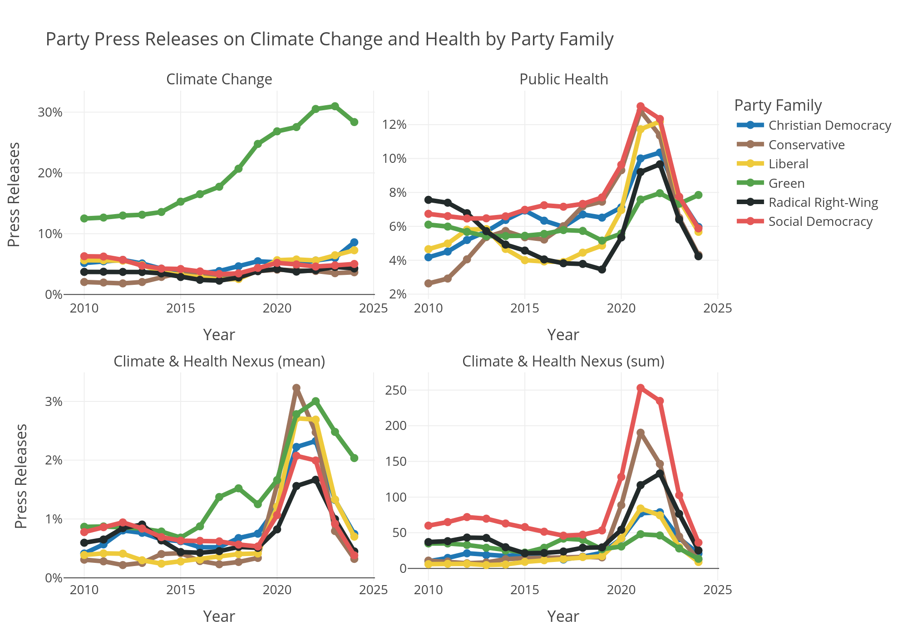

### Data and code for *The Lancet Countdown on Health and Climate Change*

**Indicator 5.3.3:** Political Party Engagement with Health and Climate Change

**Authors:**
- Zachary Dickson (LSE) and Cornelius Erfort (Witten/Herdecke University)

**Contents:**

- `Code`: Python code to reproduce the figures and tables in the appendix
- `Data`: Data used to create the figures and tables in the appendix
  - `indicator_5_3_3.csv`: Indicator values aggregated by party family and year
  - `indicator_5_3_3_country.csv`: Indicator values aggregated by country and year
  - `indicator_5_3_3_party.csv`: Indicator values aggregated by individual party and year (see below)
  - `llm_validation_data.parquet`: Data used for the LLM validation
- `appendix`: Appendix with figures and tables, including pdf, latex, markdown and .docx versions
- `readme.md`: This file

---

### Party-level data (`indicator_5_3_3_party.csv`)

Each row is one party in one year (2010–2024). The file covers 127 parties across 29 countries.

| Column | Description |
|---|---|
| `country` | Country name |
| `party` | Party name |
| `party_family` | Party family (e.g. Social Democracy, Green, Conservative) |
| `year` | Year |
| `environment_climate_mean` | Share of press releases classified as environment/climate (issue 1) |
| `healthcare_mean` | Share of press releases classified as healthcare (issue 1) |
| `climate_health_mean` | Share of press releases touching both climate and health (the nexus) |
| `n_total` | Number of press releases by that party in that year |
| `low_data` | `True` if `n_total < 40` — estimates unreliable, interpret with caution |

**Data quality notes:**

- Parties with fewer than 200 press releases in total across all years are excluded from this file, as estimates for very small parties are too noisy to be meaningful.
- Individual party-years where `n_total < 40` are flagged with `low_data = True`. The mean values are still included but should be treated with caution — small sample sizes make year-to-year changes hard to distinguish from noise. In the appendix figures, these years are shown as dashed grey lines rather than solid coloured lines.
- All three mean columns are proportions (0–1), not percentages.

